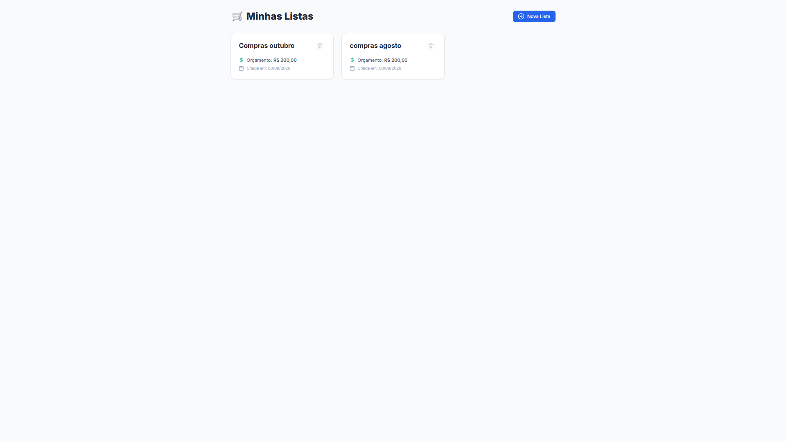
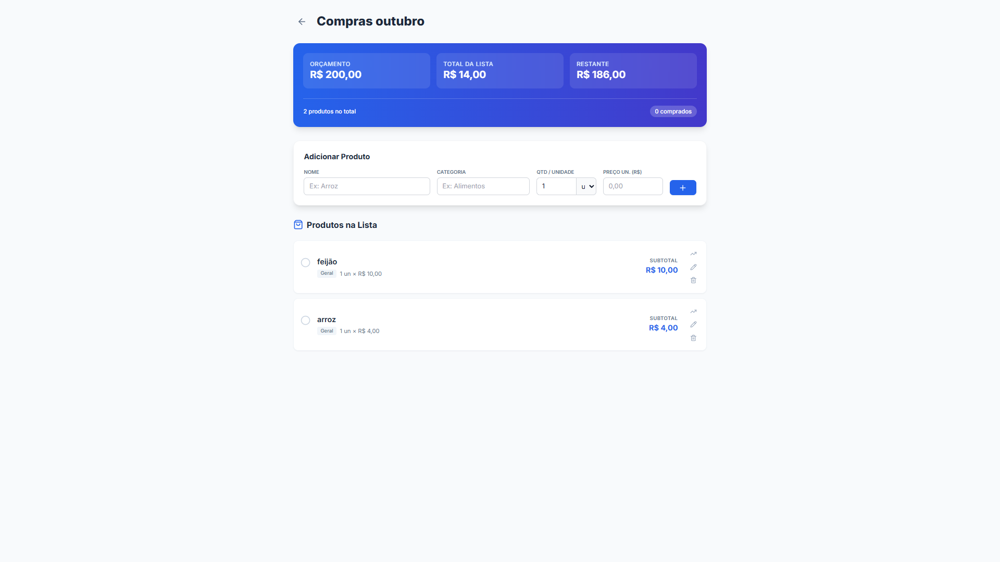

# 🛒 Lista de Compras (Shopping List)

Um aplicativo web full-stack para gerenciamento de listas de compras, desenvolvido com uma API REST em Python (Flask) no backend e uma interface de usuário moderna em React (com TypeScript e Tailwind CSS) no frontend.

## 📸 Screenshots





## 🚀 Tecnologias Utilizadas

### Frontend
- **[React](https://react.dev/)** com **TypeScript**
- **[Vite](https://vitejs.dev/)** para build e desenvolvimento rápido
- **[Tailwind CSS](https://tailwindcss.com/)** para estilização
- **[Axios](https://axios-http.com/)** para requisições HTTP
- **[Lucide React](https://lucide.dev/)** para ícones
- **[Recharts](https://recharts.org/)** para gráficos e visualização de dados

### Backend
- **[Python](https://www.python.org/)** (3.12+)
- **[Flask](https://flask.palletsprojects.com/)** como microframework web
- **[Flask-SQLAlchemy](https://flask-sqlalchemy.palletsprojects.com/)** como ORM para banco de dados
- **[Flask-CORS](https://flask-cors.readthedocs.io/)** para integração entre frontend e backend

---

## 📁 Estrutura do Projeto

O repositório é dividido em dois diretórios principais:

```text
lista_compras_flask/
├── backend/          # API REST feita em Flask
│   ├── app/          # Lógica da aplicação, rotas e modelos
│   ├── instance/     # Banco de dados local (SQLite, etc.)
│   ├── requirements.txt # Dependências do Python
│   └── run.py        # Arquivo principal para iniciar o servidor
│
├── frontend/         # Aplicação SPA feita em React + Vite
│   ├── public/       # Arquivos estáticos
│   ├── src/          # Código-fonte React, componentes e páginas
│   ├── package.json  # Dependências do Node.js
│   └── tailwind.config.js # Configurações do Tailwind CSS
└── README.md
```

---

## ⚙️ Pré-requisitos

Certifique-se de ter as seguintes ferramentas instaladas em sua máquina:
- [Node.js](https://nodejs.org/) (v18 ou superior)
- [Python](https://www.python.org/downloads/) (v3.12 ou superior)

---

## 🛠️ Instalação e Configuração

### 1. Configurando o Backend (API)

Abra o terminal, navegue até a pasta raiz do projeto e entre na pasta `backend`:

```bash
cd backend
```

Crie um ambiente virtual para isolar as dependências:
```bash
python -m venv venv
```

Ative o ambiente virtual:
- **Windows (PowerShell):**
  ```powershell
  .\venv\Scripts\activate
  ```
- **Linux/macOS:**
  ```bash
  source venv/bin/activate
  ```

Instale as dependências:
```bash
pip install -r requirements.txt
```

### 2. Configurando o Frontend

Abra **outro terminal**, navegue até a pasta raiz do projeto e entre na pasta `frontend`:

```bash
cd frontend
```

Instale as dependências do Node:
```bash
npm install
```

---

## ▶️ Como Rodar a Aplicação

Para ver o projeto funcionando localmente, você precisa rodar o servidor do backend e do frontend simultaneamente.

### Iniciando o Backend
Com o ambiente virtual ativado no terminal da pasta `backend`, execute:
```bash
python run.py
```
A API estará rodando, geralmente em `http://localhost:5000` (ou na porta configurada).

### Iniciando o Frontend
No terminal da pasta `frontend`, execute:
```bash
npm run dev
```
Isso iniciará o servidor de desenvolvimento do Vite, geralmente acessível em `http://localhost:5173`. Acesse essa URL no seu navegador para usar a aplicação.

---

## 🤝 Contribuindo

1. Faça o *fork* do projeto
2. Crie uma branch para sua funcionalidade (`git checkout -b feature/minha-feature`)
3. Faça o *commit* das suas alterações (`git commit -m 'feat: Adicionando uma nova feature'`)
4. Faça o *push* para a branch (`git push origin feature/minha-feature`)
5. Abra um *Pull Request*

---

**Desenvolvido com 💙**
